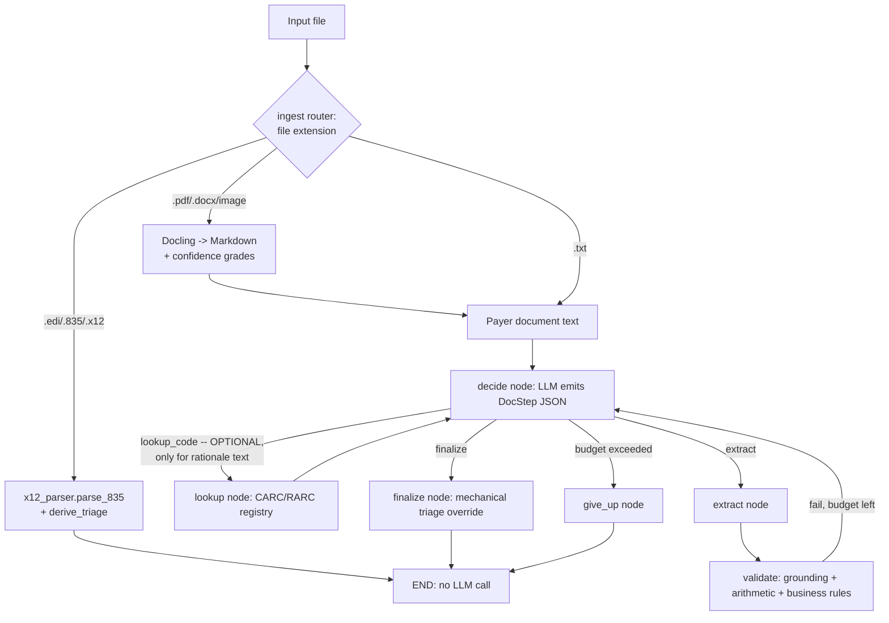
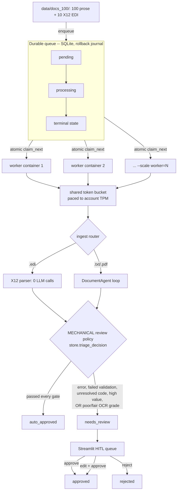

# Agentic Document Extraction — an exploration using public documents

A personal project for learning **agentic extraction** end to end: getting an
LLM to pull structured data out of messy documents and then *prove* the result
is correct rather than trusting it.

The agent reads an unstructured payer document (denial letter, EOB, remittance
advice), **extracts a validated structured record, mechanically verifies it
against the source text, self-corrects what fails, and returns an actionable
denial-triage decision** — appealable or not, category, dollars at risk,
recommended next step.

Healthcare revenue-cycle correspondence is the testing ground because its
failure modes are unforgiving: a fabricated claim number or an inflated paid
amount propagates straight into an appeal or a write-off. Everything here runs
on **public and synthetic documents only** — no PHI, no proprietary data. See
[Data sources](#data-sources).

A second domain (**Data Analysis** — CSV insight agent) proved the architecture
is domain-agnostic and has since moved to [legacy/](legacy/) so the active
codebase stays focused on extraction. It still runs standalone — see
[Legacy: CSV data-analysis agent](#legacy-csv-data-analysis-agent).

> Running notes on what worked, what broke, and what I learned live in
> [LEARNING.md](LEARNING.md). For a module-by-module guide to the codebase —
> what each file is for and what every function in it does — see
> [RUNBOOK.md](RUNBOOK.md).

---

## Scope: what's actually built, and where it's deliberately simplified

**What's real and running:** a LangGraph agent loop with a mechanical
verify/self-correct cycle (not model self-assessment); three independent
document formats sharing one schema; a real, published 297-code CARC
registry; a deterministic X12 835 EDI parser (zero LLM calls, zero
hallucination surface); Docling-based PDF/image ingestion with real OCR
confidence grades; a durable SQLite job queue with a mechanical human-review
policy (dollar threshold, unresolved codes, OCR grade, random QA-audit
sample); 85 unit tests; a second independent LLM-judge eval; and a
multi-model cost/accuracy comparison tool. All of it runs against real LLM
providers — see [Guardrails](#guardrails-why-this-number-is-real) for the
evidence this isn't just prompt-and-pray.

**What's honestly hardcoded, and why that's fine at this stage:**

| Hardcoded thing | Where | Why it's static, not learned/external |
|---|---|---|
| 16 curated CARC entries with analyst-authored `typical_action` text | `_CURATED_CODES` in [registry/codes.py](src/docproc/registry/codes.py) | Hand-written domain judgment for the codes this project's sample documents actually use — a real deployment would source this from an RCM team's playbook, not code |
| 297 real CARC code descriptions | `RAW_CARC` in [registry/carc_codes.py](src/docproc/registry/carc_codes.py) | A **snapshot** fetched once from x12.org (`scripts/fetch_carc_codes.py` regenerates it) — real, verbatim X12 data, but static until re-fetched; production would refresh on X12's own update cadence, not vendor this file |
| Keyword → category heuristic (~30 rules) + one generic action per category | `_CATEGORY_KEYWORDS` / `_ACTION_BY_CATEGORY` in [registry/codes.py](src/docproc/registry/codes.py) | The 281 real CARC codes *outside* the curated 16 have no analyst-authored action — this fills the gap with a heuristic instead of returning `None`, and defaults to "documentation" (flag for human review) rather than guessing when nothing matches |
| Per-model $/1M-token pricing (4 models) | `PRICING_PER_1M` in [evaluation/pricing.py](src/docproc/evaluation/pricing.py) | A pricing **snapshot** fetched once from openai.com — providers change prices; `estimate_cost()` returns `None` (never a guess) for any model not in the table, rather than silently reporting $0.00 |
| 3 fixed document templates (denial letter / EOB / remittance) | `RENDERERS` in [generator.py](src/docproc/generator.py) | This is *why* the synthetic corpus is structurally regular — real payer mail has far more layout variety than 3 fixed templates, see Known limitations below |
| Review-policy thresholds (`$5,000` high-value gate, `0%` QA-sample rate) | `ReviewPolicy` in [queue/store.py](src/docproc/queue/store.py) | Deliberately simple constants, tunable by env var/CLI flag — a real deployment would size these against actual appeal-cost and reviewer-capacity data, not a code default |

None of this is hidden inside a black box: every one of these is a plain
Python dict/list/dataclass field, readable and editable in one place, and
every fallback path is designed to say "not found" / "unknown" / `None`
rather than fabricate a value the model or a report consumer might trust as
real. The scope boundary is: **this project proves the extraction +
verification + triage *architecture* works, using real (if sometimes
curated or snapshotted) domain data — it does not claim to be a maintained,
continuously-refreshed enterprise CARC/pricing knowledge base.**

**Explicitly out of scope** (not started, not partially built):
- Real PHI/payer data, a BAA-covered provider, or redaction — see
  [Known limitations](#known-limitations).
- RARC (remark code) integration — fetched/inspected during research, never
  wired into the registry or triage logic.
- Any persistence beyond SQLite — deliberately the smallest durable
  thing that works on a laptop, not a production-scale queue (see
  [Scaling this to enterprise volume](#scaling-this-to-enterprise-volume)
  for the explicit swap-out path).
- Auth, multi-tenancy, or per-client configuration of any kind.
- A full X12 835 grammar — `x12_parser.parse_835` handles one claim's worth
  of segments (N1/CLP/NM1/DTM/SVC/CAS); real 835s have loops, repeats, and
  optional segments this doesn't cover.

---

## Why this design

- **Verification is mechanical, not vibes.** Every extracted field must quote a
  span that literally occurs in the document; a validator then checks grounding,
  arithmetic (line items must sum to stated totals, paid <= allowed <= charged),
  and business rules (dates ordered, codes present in the CARC/RARC registry).
  The agent self-corrects against *those* failures rather than being asked to
  "reflect".
- **Ground truth is exact by construction.** Documents are rendered FROM known
  structured records, so evaluation reports real field-level precision/recall
  instead of a qualitative judgement — no hand labelling, fully reproducible.
- **Three surface formats, one schema.** Denial letter / EOB table / 835
  remittance express the same record with different layouts, wording, and
  date-money formats. An extractor that only handles one template is overfitting
  to layout, and the mixed set exposes it.
- **A real domain tool.** The CARC/RARC registry lookup is what turns raw
  extraction into triage: CO-197 (auth missing) is appealable; CO-45
  (contractual) is a write-off, not an appeal.
- **Framework: LangGraph.** The agent loop is a LangGraph `StateGraph`
  (`src/docproc/agent.py`) with nodes `decide → {lookup_code | extract |
  finalize | give_up}` and conditional edges that form the loop.
- **Structured JSON control loop, not provider tool-calling.** Every turn is a
  Pydantic-validated `DocStep` (`lookup_code` / `extract` / `finalize`). This
  keeps one identical control loop across Anthropic, OpenAI, Gemini, and every
  other LiteLLM-routed provider, and makes each decision inspectable and
  testable.

---

## Architecture

```
  Input file
      |
      v
  [ingest router]  .edi/.835/.x12 --> x12_parser.parse_835 --> deterministic
      |                                triage (derive_triage) --> END
      |  .pdf/.docx/image --> Docling --> Markdown --\
      |  .txt --> read as-is -----------------------> |
      v                                                v
    START                                        (same LLM loop below)
      |
      v
   [decide] ---- lookup_code --> [lookup]  CARC/RARC registry --------\
      |  ^                                                            |
      |  |                                                            |
      |  +---- extract -------> [extract] --> VALIDATE ---------------+
      |  |                                    (grounding / arithmetic /
      |  |                                     business rules)
      |  |                                        | fail & budget left
      |  +----------------------------------------+
      |
      +---- finalize --------> [finalize] --> triage --> END
      +---- budget exceeded -> [give_up] ------------> END
```

Mermaid version:



The loop is `reason -> act (tool) -> observe (validation report) ->
self-correct -> respond`, bounded by a hard step cap and a correction-round
budget. The distinctive property: the "observe" step is a *mechanical*
validator, not the model grading itself — self-correction is driven by
verifiable failures, not a "reflect on your answer" prompt.

`lookup_code` is marked optional above because `derive_triage` overrides
`is_appealable`/`denial_category`/`dollars_at_risk` from the registry
regardless of whether the model called it — see
["Getting good accuracy with fewer tokens"](#getting-good-accuracy-with-fewer-tokens)
for the real, measured token savings from making this explicit in the prompt.

A second distinctive property, added after real testing showed a model can
extract every field correctly and still misjudge triage: the *triage*
decision (`is_appealable`/`denial_category`/`dollars_at_risk`) is never
trusted from the model's own prose either. `codes.derive_triage` recomputes
it mechanically from the (already-validated) `denial_codes`, the same way
for the LLM path and the deterministic EDI path — a real cross-tier test
(`gpt-4.1` vs `gpt-4.1-mini`) showed this take `gpt-4.1-mini`'s triage
accuracy from 2/9 to 9/9 with zero prompt or model change.

### Module layout

```
src/
  cli.py               CLI entrypoint: extract + validate + triage one document
  common.py             shared helper (_extract_json)
  llm.py                LiteLLM gateway (any provider); retries + streaming
  config.py             env-based settings (pydantic-settings)
  logging_utils.py       console logging + JSONL trace per run
  docproc/
    agent.py            LangGraph StateGraph: decide/lookup/extract/finalize/give_up
    schemas.py          Pydantic contracts (DocStep, ClaimExtraction, FieldValue...)
    validation.py       grounding / arithmetic / business-rule checks (single document)
    prompts.py          system prompt + message builders
    generator.py        synthetic corpus generator: single docs + matched claim triads
    registry/            CARC/RARC denial-code domain knowledge
      codes.py            CarcRegistry class: two-tier lookup + mechanical triage derivation
      carc_codes.py       generated: 297 real CARC codes fetched from x12.org (do not hand-edit)
    ingestion/            format-specific document readers
      ingest.py           router: .edi -> x12_parser (no LLM), .pdf/image/docx -> Docling, .txt -> as-is
      x12_parser.py       X12 835 EDI segment-grammar parser (reusable; used by ingest.py and the demo script)
    queue/                durable job queue + enterprise pipeline
      store.py            JobStore (SQLite, rollback-journal mode) + ReviewPolicy/triage_decision (mechanical HITL gate)
      worker.py           stateless pipeline worker: claim -> ingest -> extract -> route
      pipeline.py          operator CLI: enqueue / status / requeue / reset
      ratelimit.py         shared token-bucket rate limiter
    evaluation/           eval harnesses (no production code depends on this folder)
      evaluate.py          field-level precision/recall/F1/grounding harness
      judge_eval.py        independent LLM-judge faithfulness eval
      compare_models.py    multi-model cost/accuracy comparison CLI
      pricing.py           real per-model $/token pricing table
    workflows/            multi-document orchestration
      portfolio.py         portfolio triage orchestrator (multi-agent A)
      reconcile.py         cross-document reconciliation (multi-agent B) + ClaimReconciler
scripts/
  extract_x12_835.py    real X12 835 EDI parser demo (imports src/docproc/ingestion/x12_parser.py)
  fetch_carc_codes.py   fetches/regenerates carc_codes.py from the live X12.org CARC list
ui/
  streamlit_app.py       primary Streamlit UI: single doc / batch / reconciliation / HITL review queue
data/
  docs/                 synthetic corpus (9 docs, 3 formats) + ground_truth.json
  matched_claims/       matched claim triads for reconciliation (generated, gitignored)
  real_world/           real-format (X12 835) sample, hand-built from the EDI spec
legacy/                 CSV data-analysis agent (moved out; see below)
Dockerfile, docker-compose.yml   containerized eval + UI
reports/agent_run_report_docproc.md   architecture, traces, eval results, trade-offs
reports/cheap_extraction_research.md  real pricing/caching/batch-API research + differentiation plan
LEARNING.md              running log of what worked, what broke, what I learned
RUNBOOK.md               module-by-module guide: what each file/function does and why
```

---

## Setup & run

Requires **Python 3.10+** (tested on 3.13; a stock macOS `python3` is often
3.9, which is too old for this project's pydantic v2 / LangGraph versions —
check with `python3 --version` and install a newer one via `pyenv` or
`brew install python@3.13` if needed).

```bash
git clone <this-repo-url>
cd rcm-doc-agent

python3 -m venv .venv
source .venv/bin/activate        # Windows: .venv\Scripts\activate

pip install -r requirements.txt
cp .env.example .env             # set MODEL + the matching API key -- required, no offline mode

# Regenerate the synthetic corpus (deterministic; already committed)
python -m src.docproc.generator --out data/docs --n 9 --seed 7

# Extract + validate + triage one payer document
python src/cli.py --doc data/docs/DOC-1000_denial_letter.txt

# Field-level evaluation across the corpus (precision / recall / F1 / grounding)
python -m src.docproc.evaluation.evaluate --docs data/docs

# Real-format demo: parse an actual X12 835 EDI transaction (see Data sources)
python scripts/extract_x12_835.py

# Multi-agent (A): portfolio triage across a batch of documents
python src/cli.py --batch data/docs

# Multi-agent (B): cross-document reconciliation across a claim's 3 formats
python -m src.docproc.generator --mode triads --out data/matched_claims --n 6
python src/cli.py --reconcile data/matched_claims
```

Add `--stream` for a live step-by-step trace.

### Unit tests

```bash
pip install pytest    # or: pip install -r requirements.txt (included as a dev dep)
pytest                 # 85 tests, ~0.3s, no API key or network needed
```

Every test is a pure-function test against real captured data -- no LLM
calls, no mocking of the thing under test. Coverage: the three mechanical
validators (`validation.py`, including the exact fabricated-value and
broken-arithmetic "break tests" run live earlier in this project), the
CARC/RARC registry's two-tier lookup and triage derivation (`codes.py`,
including the letter-prefixed-CARC bug caught before it shipped), the X12
835 parser against the real bundled sample (`x12_parser.py`), the JSON
extractor against real captured failure strings (`common.py`), the
FieldValue numeric-coercion fix (`schemas.py`), the token-bucket rate
limiter (`ratelimit.py`), and the durable job queue + review policy
(`store.py`, including every `triage_decision` branch: error, high-value,
unresolved-code, grounding-provenance, the OCR-confidence gate, and the
random QA-audit sample).

### Evaluation output (real, against `openai/gpt-4.1`, 2026-08-15)

```
PER-FIELD ACCURACY      all 12 fields 9/9 (100.0%)
AGGREGATE
  precision              1.000
  recall                 1.000
  F1                     1.000
  grounding rate         99/99 (100.0%)
  line items exact       9/9
  validation passed      9/9
  triage decision correct   9/9
  total tokens           42,347  (4,705/doc, 18 LLM calls, 2,353/call)
```

This is a real LLM run, not a stand-in: see `agent_run_report_docproc.md` §4a
for the full trace, including two real prompt bugs found and fixed along the
way. One provider, one 9-document corpus, one run — not yet a generalization
claim across payers, formats, or providers (see Known limitations). **Read
[Guardrails: why this number is real](#guardrails-why-this-number-is-real)
before treating 1.000 as "the model is perfect" — it isn't, and the numbers
below show exactly why the guardrails, not the model, are doing the work.**

### A second, independent eval: LLM-as-judge faithfulness (not RAGAS, and why)

[src/docproc/evaluation/judge_eval.py](src/docproc/evaluation/judge_eval.py) runs a SEPARATE LLM
call per document that never sees the extractor's own `source_text` claims
-- it re-derives support for each extracted value straight from the raw
document, so it can't be fooled by the same shortcut a substring check can
(evidence correctly quoted but assigned to the wrong field). This is the
same concept as RAGAS's `Faithfulness` metric, deliberately not the RAGAS
package itself: installing `ragas` (checked: v0.4.3) pulls in ~8
LangChain-family packages plus HuggingFace `datasets`, and even then **fails
to import out of the box** (`ModuleNotFoundError: langchain_community.
chat_models.vertexai`) -- verified, not assumed. This project also has a
standing decision to use one provider-agnostic gateway (LiteLLM) rather than
LangChain, so a custom judge built on the same `LLMClient` everything else
uses is both lighter and architecturally consistent.

```bash
python -m src.docproc.evaluation.judge_eval --docs data/docs
```

**Real result** (`gpt-4.1-mini`, same 9-document corpus):
```
fields judged           99
supported               97/99 (98.0%)
unsupported             2
documents fully supported  7/9
```
Both "unsupported" flags were on `appeal_deadline`, and both were **false
positives from the judge itself**: it flagged `2026-09-12` as unsupported
against a document stating `09/12/2026`, not realizing these are the same
date in ISO vs. US format -- the exact normalization this project's own
`_parse_date` handles correctly (confirmed: the mechanical eval scored this
field 9/9 correct). This is a genuinely useful finding in itself: the judge
is a *complementary* signal with its own distinct blind spot, not a
strictly-better oracle -- which is why it's a second opinion here, not a
replacement for the mechanical grounding check.

### Multi-model comparison, with real cost and a real bug found by using it

`evaluate()` now returns a structured results dict (model, per-doc-type
breakdown, real prompt/completion token split, real $ cost via
[src/docproc/evaluation/pricing.py](src/docproc/evaluation/pricing.py), wall time) instead of just
an exit code, and [src/docproc/evaluation/compare_models.py](src/docproc/evaluation/compare_models.py)
runs several models back-to-back on the same corpus:

```bash
python -m src.docproc.evaluation.compare_models --docs data/docs_100 --limit 10 \
    --models openai/gpt-4.1-mini,openai/gpt-4.1-nano
```

Testing `gpt-4.1-nano` (never run before this session) on a fresh 10-document
sample **found a real bug**: it correctly extracted a claim's only denial
code and even reasoned "which is appealable" in its own `thought` text, but
its `finalize` step omitted the `triage` object entirely (the schema allows
it) -- and `_finalize_node`'s override logic only fired `if triage is not
None`, so `DocOutcome.triage` silently stayed `None` on an otherwise
perfectly-extracted document. Fixed: `_finalize_node` now always constructs
a `Triage` from the registry when the model didn't provide one. Before/after,
same 10 documents:

```
                              F1   ground.   triage  tokens/doc      $/doc
BEFORE  gpt-4.1-mini       1.000    100.0%   10/10        4,656    $0.0027
BEFORE  gpt-4.1-nano       0.983    100.0%    9/10        7,542    $0.0011
AFTER   gpt-4.1-mini       1.000    100.0%   10/10        4,840    $0.0028
AFTER   gpt-4.1-nano       0.992    100.0%   10/10        7,308    $0.0011
```

Triage went from 9/10 to 10/10, and `gpt-4.1-nano` is now the cheapest model
meeting the F1>0.9/100%-triage bar in this comparison -- but that
conclusion would have been wrong before the fix, since the apparent gap was
a bug in this project's own finalize logic, not a real model limitation.
Full trace and analysis in [LEARNING.md](LEARNING.md). Only tested on 10
documents so far -- not yet confirmed at the 110-document scale the earlier
6%-failure-rate investigation needed to surface a similar issue.

---

## Guardrails: why this number is real

A blind "trust the LLM" pipeline does **not** produce this output. Four
mechanical guardrails sit between the model's raw response and the number
above, and the self-correction loop exists specifically because the model's
*first* answer is often wrong in a way these guardrails catch.

### The four guardrails

1. **Grounding** (`validation.py::check_grounding`) — every extracted field
   must carry `source_text`: a verbatim substring that literally occurs in
   the document. A value with no matching span is an error, full stop — this
   is the anti-hallucination check, and it's a hard string-containment test,
   not a model self-assessment.
2. **Arithmetic** (`check_arithmetic`) — line items must sum to the stated
   totals, and `paid <= allowed <= charged` at both the claim and line level.
   Catches a wrong-but-quoted number grounding alone would miss (a
   transcription error can still "occur" in the text).
3. **Business rules** (`check_business_rules`) — dates parse and are ordered
   (appeal deadline after date of service), every denial code must resolve
   in the CARC registry (297 real X12 codes + 16 curated), member ID matches
   a plausible format.
4. **Deterministic triage** (`codes.py::derive_triage`) — `is_appealable`,
   `denial_category`, and `dollars_at_risk` are **never taken from the
   model's own words**. They're mechanically recomputed from the
   already-validated `denial_codes` via a straight registry lookup, and the
   model's triage is overridden if it disagrees.
5. **Business-risk + random-audit review gates** (`store.py::triage_decision`,
   `ReviewPolicy`) — independent of how clean the extraction looks, a
   document is still routed to a human whenever `dollars_at_risk` clears a
   configurable threshold (`$5,000` by default), *and* at a configurable
   random-sample rate (`QA_SAMPLE_RATE`, `0` by default) purely to keep
   auditing real-world accuracy over time. See
   [What does human review actually do](#what-does-human-review-actually-do-if-extraction-is-already-this-accurate)
   below for why this gate exists even when the pipeline's own numbers look
   perfect.

### Why guardrail #4 matters more than it sounds

This is the concrete proof the guardrails — not raw model quality — produce
the 100%: a real cross-tier test on this exact corpus showed `gpt-4.1-mini`
extracting every field correctly (100% field accuracy) while its **own**
triage reasoning was correct on only **2 of 9** documents — it would
paraphrase a registry category instead of copying it verbatim, or invert an
appealability verdict. None of grounding/arithmetic/business-rules catches
this, because the extracted *fields* were genuinely right; only the
*reasoning built on top of them* was wrong. After wiring `derive_triage` in,
the same model's triage went to **9/9** — with zero prompt or model change.
The lesson generalizes: **an LLM being right about the facts and an LLM
being right about a judgment call built on those facts are two separate
claims, and only one mechanical check here verifies each.**

### The self-correction loop is doing real work, not padding

The agent doesn't get one shot. `_extract_node` runs `validate()` against
whatever the model just emitted and feeds the concrete failures back as the
next turn's message ("field X: message") — the model sees exactly what
failed and why, then re-emits. This is bounded (`max_steps`, a hard step
cap) so a document that can't be fixed terminates as `incomplete`/`give_up`
rather than looping forever; it does **not** retry into infinity to force a
clean number. Two real, first-run prompt bugs (documented in
[LEARNING.md](LEARNING.md)) were caught by the *eval* dropping below 1.000
before they were fixed — the number has been wrong before, and dropped when
something was actually wrong.

### What this number does NOT prove — read this before trusting it

- **The corpus is synthetic and small (9 documents).** `generator.py` builds
  the ground-truth record *first*, then renders it into one of 3 fixed
  templates — so "ground truth is exact by construction" also means the
  documents are far more structurally regular than real, messy payer mail.
  This is deliberate (no PHI, no hand-labeling ambiguity) but it means 1.000
  here is not a claim about real-world documents.
- **A 100-document real test on this same pipeline found real failures a
  9-document run cannot surface**: a ~6% invalid-JSON rate from
  `gpt-4.1-mini` (root-caused and fixed — see LEARNING.md), and a bug where
  the grounding check was wrongly applied to deterministic (non-LLM) X12
  output. Both were invisible in the number above and only appeared at
  scale.
- **Docling (PDF/image ingestion) has been verified on exactly one generated
  PDF.** Real scanned/handwritten mail, multi-page documents, and unusual
  payer table layouts are untested.
- **The registry's category/action text is a mix of curated (16 codes,
  analyst-authored) and heuristic (281 codes, keyword-matched onto real X12
  descriptions)** — the heuristic tier can be wrong for an ambiguous
  description; it defaults to "documentation" (flag for human review) rather
  than guessing, but it's not authoritative.

The honest framing: **1.000 is real, reproducible, and load-bearing evidence
that the guardrail architecture works as designed on the case it was built
and tested against** — it is not evidence that the underlying LLM is
infallible, and it is not yet evidence of generalization to real-world
document diversity.

### What does human review actually do if extraction is already this accurate?

A fair objection to a near-perfect score: if the pipeline is already this
good, what is a human reviewer for? Three concrete answers, none of them
"trust the model less":

1. **The review gate is a business-risk policy, not an accuracy signal.**
   Look at `triage_decision()` in `store.py`: `dollars_at_risk >=
   high_value_threshold` forces review *regardless* of how clean the
   extraction is — a perfectly-extracted $40,000 claim still goes to a
   human, by design, because the cost of a wrong appeal decision scales with
   the dollar amount, not with how confident the model sounded. Same for an
   unresolved denial code: the registry not recognizing a code forces review
   even when every other field grounded and validated cleanly. Neither gate
   reads the model's self-assessment at all.
2. **The 9-document eval is not the population human review is sized for.**
   The real 100-document pipeline run (documented above and in
   [LEARNING.md](LEARNING.md)) needed genuine human attention for reasons
   invisible in the 9-doc number: a ~6% invalid-JSON failure rate from
   `gpt-4.1-mini`, an EDI-grounding false-positive that flooded the queue
   with 10/10 documents before it was fixed, and — found this session,
   testing `gpt-4.1-nano` — a model that silently omitted the entire
   `triage` object on some documents. Every one of these was a real defect
   a 9-document synthetic corpus could not surface. At real payer volume and
   document diversity, the failure surface is larger than these numbers
   suggest, which is exactly the case human review exists for.
3. **A fixed-rate audit sample, independent of any gate, is now built in.**
   `ReviewPolicy.qa_sample_rate` (env: `QA_SAMPLE_RATE`, CLI:
   `--qa-sample-rate`, default `0`) routes a configurable fraction of
   otherwise-clean documents to review anyway — a real production pattern
   (continuous QA sampling) for the exact concern being raised here: a
   corpus measuring 100% today is not proof against silent drift (a payer
   changing its EOB template, a model provider updating weights) tomorrow.
   The sample is keyed off a stable hash of the job id, so a given document
   always samples the same way on retry — verified with a real pipeline run
   at `--qa-sample-rate 0.34` on the 9-document corpus: 3/9 documents
   (`DOC-1001`, `DOC-1004`, `DOC-1006`) were routed to `needs_review` purely
   for the audit reason, with `review_reason` recording exactly that.

The short version: this system is built to send a human *every* high-value
claim and *every* unresolved code no matter how the model performs, plus a
tunable ongoing random sample — human review's job was never "catch the
rare mistake in an otherwise-static accuracy number," it's "own the
decisions where being wrong is expensive, and keep independently checking
that the number hasn't quietly drifted."

---

## Getting good accuracy with fewer tokens

Every LLM call resends the full system prompt — so the biggest token lever
isn't prompt wording, it's the **number of round trips per document**. This
was measured, not assumed: `src/llm.py` now captures the real
`prompt_tokens`/`completion_tokens`/`total_tokens` the provider reports on
every call (not an estimate), accumulated per document and surfaced in
`evaluate.py`'s aggregate output as `total tokens`.

**The lever found**: `derive_triage` (see
[Guardrails](#guardrails-why-this-number-is-real)) already overrides
`is_appealable`/`denial_category`/`dollars_at_risk` from the registry
regardless of what the model computes — so a model calling the optional
`lookup_code` tool to reason more carefully about those fields was spending
a full extra round trip (a complete resend of the ~1,200-token system
prompt) on something that doesn't change the graded outcome. The prompt now
says this explicitly: `lookup_code` is for writing a better `rationale`, not
for getting the numeric/category fields right, and the model is told to
finalize directly when it already recognizes the codes.

**Real, measured result** (`gpt-4.1-mini`, same 9-document corpus, real API
calls, before vs. after that one prompt change — nothing else changed):

| | Total tokens | Tokens/doc | LLM calls | F1 | Triage correct |
|---|---|---|---|---|---|
| Before | 49,811 | 5,535 | 22 | 1.000 | 9/9 |
| After | 41,762 | 4,640 | 18 | 1.000 | 9/9 |

**16% fewer tokens, 4 fewer LLM calls, zero accuracy loss** — reproduced on a
second run (41,773 tokens, effectively identical) and confirmed the new
prompt still holds F1 1.000 / 9/9 triage on `gpt-4.1` as well. The finding
generalizes beyond "shorter prompt wording": **the model doesn't need to be
right about something a downstream mechanical check is going to override
anyway** — telling it so removes work (and tokens) it was doing for no
graded benefit. Full write-up with the exact numbers in
[LEARNING.md](LEARNING.md).

This does **not** mean fewer tokens is free everywhere: the `lookup_code`
round trip still matters when the model needs a code's real meaning to write
an accurate `rationale`/`recommended_action` — those two fields are *not*
overridden, only the numeric/category triage fields are. The safe version of
this optimization is "skip the extra call when you don't need it," not "never
look anything up."

---

### Supported LLM providers

| Tier | Model string | Env var |
|---|---|---|
| Free tier | `gemini/gemini-2.5-flash` | `GEMINI_API_KEY` |
| Free / fast | `groq/llama-3.3-70b-versatile` | `GROQ_API_KEY` |
| Cheap paid | `deepseek/deepseek-chat` | `DEEPSEEK_API_KEY` |
| Frontier | `anthropic/claude-sonnet-4-5`, `openai/gpt-4.1` | `ANTHROPIC_API_KEY`, `OPENAI_API_KEY` |
| Local | `ollama/llama3.1` | none (set `API_BASE`) |

Any OpenAI-compatible endpoint (self-hosted vLLM, a gateway) works by setting
`API_BASE`. A valid key for the chosen provider is always required — there is
no offline mode.

CLI flags (`--model`, `--temperature`) override `.env`. Every run
writes a JSONL reasoning trace to `logs/run_<id>.jsonl`.

---

## Additional capabilities

| Capability | How to run | Where |
|---|---|---|
| **Simple UI** | `pip install streamlit && streamlit run ui/streamlit_app.py` | `ui/streamlit_app.py` — single document, portfolio triage, and reconciliation, all in one app |
| **Streaming responses** | `python src/cli.py --doc ... --stream` (reasoning steps stream live) | `on_event` in `src/cli.py`, `on_token`/`on_event` in `src/docproc/agent.py` |
| **Containerized deployment** | `docker compose up eval` / `docker compose up ui` | `Dockerfile`, `docker-compose.yml` |
| **Real-format extraction demo** | `python scripts/extract_x12_835.py` | `scripts/extract_x12_835.py`, `data/real_world/` |
| **X12 835 EDI ingestion (no LLM)** | `python src/cli.py --doc data/real_world/sample_835.edi` | `src/docproc/ingestion/ingest.py` + `x12_parser.py` — deterministic extraction *and* triage, zero LLM calls |
| **Real CARC code registry (297 codes)** | `python scripts/fetch_carc_codes.py` (regenerate); used automatically by `codes.py::lookup_code` | `src/docproc/registry/carc_codes.py`, fetched from [x12.org](https://x12.org/codes/claim-adjustment-reason-codes) — any real CARC code outside the curated 16 now resolves to a genuine, sourced description |
| **PDF / image / DOCX ingestion** | `pip install docling`, then `python src/cli.py --doc some_file.pdf` | `src/docproc/ingestion/ingest.py` — Docling converts to Markdown, then the normal LLM path runs on it |
| **Multi-agent A: portfolio triage** | `python src/cli.py --batch data/docs` | `src/docproc/workflows/portfolio.py` (planner → fresh `DocumentAgent` per doc → synthesizer ranks by $ at risk) |
| **Multi-agent B: cross-document reconciliation** | `python -m src.docproc.generator --mode triads --out data/matched_claims --n 6` then `python src/cli.py --reconcile data/matched_claims` | `src/docproc/workflows/reconcile.py` (fresh `DocumentAgent` per document in a claim group → cross-check) |

The Streamlit UI wraps all three CLI modes above — a picker for sample/uploaded
documents, a live-streamed reasoning trace, the extraction table + validation
result + triage card for single documents, a ranked worklist with a
by-category chart for the portfolio mode, and per-claim discrepancy reports
(plus a built-in "caught N/M injected discrepancies" scoreboard) for
reconciliation. All three modes were run end-to-end in a real browser and
matched the CLI output exactly.

**A** mirrors the CSV agent's old planner/synthesizer shape (`legacy/orchestrator.py`)
applied to a batch of documents instead of subtasks — reuses `DocumentAgent`
unchanged. **B** is a genuinely different kind of multi-agent case: no single
document can catch an inconsistency between what the EOB told the provider and
what a later, corrected remittance actually paid — that requires more than one
agent's output to exist at once. See the traces and the one real bug this
surfaced (a no-op "correction" on a fully-denied claim) in [LEARNING.md](LEARNING.md).

Cross-session memory previously lived here for the CSV agent; it's moved to
[legacy/](#legacy-csv-data-analysis-agent).

### Docker

```bash
docker build -t doc-agent .
docker run --rm doc-agent                        # runs the field-level eval
docker run --rm doc-agent python src/cli.py --doc data/docs/DOC-1000_denial_letter.txt
```

---

## Capability map — where each piece lives

| Capability | Where |
|---|---|
| Agent loop reason→act→observe→self-correct→respond | `src/docproc/agent.py` (LangGraph StateGraph) |
| ≥1 tool / function call | `src/docproc/registry/codes.py::lookup_codes` (CARC registry: ~16 curated + 297 real X12-fetched codes as fallback) |
| Structured output parsing (Pydantic / JSON) | `src/docproc/schemas.py`, `DocStep.model_validate_json` |
| Advanced technique | chain-of-thought (`thought`) + **self-critique/self-correction** on failed validation (`src/docproc/agent.py::_extract_node`) + grounded evidence (`source_text`) |
| LLM failure handling (retries/timeout/fallback) | `src/llm.py` (backoff + typed errors), `give_up` node in `src/docproc/agent.py` |
| Input validation & guard-rails | `src/docproc/validation.py` (grounding / arithmetic / business rules), step + retry budgets in `src/config.py` |
| Per-step logging / inspectable trace | `src/logging_utils.py::RunTrace` (JSONL + console) |
| Evaluation (expected vs actual) | `src/docproc/evaluation/evaluate.py` against `data/docs/ground_truth.json` |
| Config externalized | `src/config.py` + `.env.example` |

---

## Data sources

Everything in `data/docs/` is **synthetic**, rendered from known records by
`src/docproc/generator.py` so ground truth is exact and no PHI is involved.
The public sources that would replace or augment it:

| Source | What it provides | Access |
|---|---|---|
| **Payer EDI companion guides** (Anthem, UHC, Cigna, Blues) | Real 835 layouts with sample transactions — genuine payer formatting, zero PHI | Public |
| **X12** (`x12.org`) — ✅ **done** | Official 835 spec and the full CARC code set — 297 real, current codes fetched live and wired into `codes.py` as a fallback registry (see [scripts/fetch_carc_codes.py](scripts/fetch_carc_codes.py)); RARC (900+ supplemental remark codes) fetched/inspected but not yet integrated | Public |
| **Synthea** (`github.com/synthetichealth/synthea`) | Synthetic patients, claims, FHIR `ExplanationOfBenefit` with coherent code distributions | Open source |
| **CMS Blue Button 2.0 sandbox** | Synthetic Medicare EOBs over FHIR | Public, no DUA |
| **CMS SynPUFs** | De-identified Medicare claims | Public |
| **State DOI / external-review (IRO) sites** | Real denial-letter prose and structure, already redacted | Public |
| **ResDAC** (`resdac.org`) | Genuine Medicare claims | DUA + IRB |
| **RVL-CDIP, FUNSD, DocVQA, CORD, SROIE** | OCR and layout noise for robustness testing | Public |

Note that an 835 is *already structured*, so it is not an extraction target —
it is a **ground-truth oracle**. Parsing the 835 for a claim and diffing against
the extraction of the paired paper letter yields real labels without hand
annotation.

Real PHI would require a BAA-covered provider, Safe Harbor de-identification
before anything leaves the trust boundary, and audit logging of every extraction
decision. None of that is in scope here.

---

## Real data deep dive: how the CARC registry and Docling were actually built

Two pieces of this project use genuine public data/tooling, not synthetic
stand-ins. Both came from the same question: *"is this fake data dressed up
as domain knowledge, or the real thing?"* — and in both cases the honest
answer, at the time, was "fake, but easy to fix."

### 1. The CARC registry: from 16 made-up codes to 297 real ones

**The problem.** `src/docproc/registry/codes.py`'s original `_REGISTRY` had ~16 denial
codes I wrote myself, and its own docstring admitted it: "modelled on the
public X12 CARC/RARC code sets... a representative subset." That's honestly
labeled, but it's still invented data pretending to be domain knowledge — any
real payer document using a code outside that curated 16 would get `None`
back from the registry, meaning the agent would have *zero* triage
information for the majority of real-world denials.

**The rationale.** X12.org — the actual standards body that publishes the
HIPAA-mandated code sets referenced by every 835 remittance advice in the
US — hosts the full, current CARC list ("External Code Source 139") as a
plain, parseable HTML table, publicly and for free. There was no reason to
keep hand-picking codes when the authoritative source is one HTTP request
away.

**How it was done:**
1. Fetched the raw HTML of `x12.org/codes/claim-adjustment-reason-codes` and
   inspected the actual markup (not just a rendered/Markdown view of the
   page) — found a clean `<table id="codelist">` with each row tagged
   `class="prod-set current"` or `class="prod-set deactivated"`.
2. Wrote [scripts/fetch_carc_codes.py](scripts/fetch_carc_codes.py): downloads
   the page, parses it with BeautifulSoup, keeps only *current* (non-retired)
   codes, strips the trailing "Start: .../Last Modified: ..." metadata, and
   writes a generated data file, [src/docproc/registry/carc_codes.py](src/docproc/registry/carc_codes.py)
   (`RAW_CARC: dict[str, str]`) — 297 codes, verbatim X12 descriptions, no
   invented fields, regenerate any time by re-running the script.
3. Wired it into `codes.py::lookup_code` as a **second tier**: the curated
   16 (which have hand-written, analyst-quality `typical_action` text) are
   tried first; anything not found there falls back to the real X12 data,
   run through `_categorize_carc` — a keyword heuristic (`"fee schedule"` →
   contractual, `"authorization"` → authorization, `"not covered"` →
   coverage, etc.) that maps the *real* description onto this project's
   existing category vocabulary, since X12's own list has no category field
   at all — that classification is domain judgment this project adds, now
   applied to genuine data instead of invented data.
4. Caught a real bug in my own first draft before it shipped: I initially
   stripped a code's group-code prefix (`CO-`/`PR-`/etc.) with
   `str.lstrip("COPRAIOAPI")` — but real CARC codes themselves can start with
   those same letters (`A1`, `B4`, `P12`...), so that would have silently
   mangled them. Fixed by only stripping when the prefix is an exact match
   against one of the 5 real group codes (`CO`, `OA`, `PI`, `PR`, `CR`) *and*
   there's an explicit dash — otherwise the code is used as-is.

**What this achieved.** Codes that previously returned `None` (no domain
knowledge at all) now resolve to real, sourced descriptions with a derived
category and appealability:
```
CO-96   -> category=coverage      appealable=True   (was: None)
OA-23   -> category=documentation appealable=True   (was: None)
CO-A1   -> category=documentation appealable=True   (was: None)
CO-XYZ999 -> NOT FOUND  (correctly — not a real code; never invents a meaning)
```
Full corpus eval after the change was unchanged (F1 1.000, 9/9 triage
correct) — the two-tier design means the switch to real data didn't disturb
anything the curated registry already handled; it only filled in what used
to be a hole. Full write-up, including the bug, in
[LEARNING.md](LEARNING.md).

### 2. Docling: real PDF/image ingestion, not just `.txt`

**The problem.** Every document in this project's pipeline was plain text —
but real payer correspondence arrives as scanned or digitally-generated PDFs,
sometimes images, sometimes DOCX. Feeding *all* input types through the LLM
regardless of source format also ignores that OCR/layout parsing is itself a
solved, mature problem — [Docling](https://docling-project.github.io) is an
open-source library that already does PDF/DOCX/image → structured
text/Markdown conversion (including OCR and table structure recovery) well.
Re-deriving that with an LLM would be slower, more expensive, and less
reliable than just using the right tool for that layer.

**The rationale.** The agent's actual value-add is *semantic* reasoning over
already-clean text — normalizing dates, reconciling wording across payers,
looking up denial codes, deciding triage. It has no special advantage at
"turning pixels into text," and shouldn't be asked to do that job.

**How it was done:**
1. Added [src/docproc/ingestion/ingest.py](src/docproc/ingestion/ingest.py): a router that looks
   at the file extension and picks the cheapest trustworthy path —
   `.edi`/`.835`/`.x12` → the deterministic X12 parser (no LLM at all);
   `.pdf`/`.docx`/image extensions → Docling converts to Markdown, which then
   feeds the *same* LLM extraction path a `.txt` file would; `.txt` →
   unchanged, read as-is.
2. Actually installed Docling (`pip install docling` — a real, heavy
   dependency: it pulled in `torch`, `transformers`, `rapidocr`, ~1.5GB) and
   ran it for real rather than just wiring the code path and assuming it
   works.
3. Since the corpus has no real scanned PDFs yet, generated one: rendered
   `DOC-1000_denial_letter.txt` to an actual PDF (via `reportlab`, since
   macOS's `textutil` can't do `.txt` → `.pdf`), then fed that PDF through
   `ingest() → Docling → DocumentAgent` end to end — a genuine file-format
   conversion, not a shortcut.

**What this achieved.** Docling correctly extracted every line of the
generated PDF (including reconstructing a Markdown table from the service
line detail), and the LLM's extraction from that Docling-converted text
matched **every single field** in `ground_truth.json` for DOC-1000 exactly —
payer name, patient, claim number, all four dollar totals, all three denial
codes, all three line items — with correct triage
(`appealable=True, category=authorization, dollars_at_risk=$3,837.01`).
Zero accuracy lost by inserting a real PDF-conversion step in front of the
LLM. The honest caveat: this has only been verified against one generated
(non-scanned, clean-text) PDF — real scanned/handwritten mail, multi-page
documents, or unusual payer table layouts are untested (see
[Known limitations](#known-limitations)).

---

## Scaling this to enterprise volume

Everything above runs one process, one document (or a small local batch) at
a time — appropriate for a learning project, not for a health system or RCM
vendor processing thousands of documents a day. This section is honest about
both what's actually been built and benchmarked toward that, and what's just
a plan.

### What enterprise-wide would actually mean

A real deployment isn't "run the CLI more times" — it changes shape:

1. **Ingestion** — documents arrive continuously from clearinghouse feeds
   (X12 835/837 over SFTP or API), fax/scan pipelines, and payer portal
   downloads, not from a local folder passed to `--batch`.
2. **Volume-appropriate routing** — most real RCM volume is *already*
   structured X12 (835/837), which this project's `ingest.py` already routes
   to the zero-LLM-cost deterministic path. Only the prose minority (scanned
   letters, portal PDFs) needs the expensive LLM path at all — the cost
   profile of "enterprise volume" is dominated by how much of it is EDI vs.
   prose, not by document count alone.
3. **Elastic, queue-based workers** — a durable queue (SQS/RabbitMQ/Kafka)
   in front of a pool of workers, each running the exact same stateless
   `DocumentAgent`/`ingest()` code that already exists here, scaled by queue
   depth rather than a fixed thread count.
4. **Cost-tiered model routing** — cheap/fast model first, escalate to a
   stronger model only on validation failure or low-confidence triage
   disagreement (the mechanical validators and `derive_triage` override
   already built here are exactly the signal an escalation policy would key
   off of).
5. **Human-in-the-loop** — any document that fails validation or has
   ambiguous triage lands in a review queue instead of silently going out —
   the portfolio worklist (`PortfolioOrchestrator`) is already the shape of
   that queue, just not yet backed by a persistent store or a reviewer UI
   action (approve/edit/reject).
6. **Observability** — dashboards for throughput, cost per document, and
   most importantly *drift*: `evaluate.py`'s golden-set F1/grounding/triage
   numbers, re-run nightly against a frozen golden set as a monitoring job,
   not just a one-time regression check.
7. **Multi-tenant isolation** — per-client config (model choice, prompt
   overrides, registry customization), isolated logs/traces/data.
8. **Compliance** — real PHI requires a BAA-covered model provider or
   redaction before anything leaves the trust boundary, encryption at rest/
   in transit, and an audit log of every extraction decision (see
   [Known limitations](#known-limitations)).

### The small subset actually built and benchmarked: concurrent batch processing

`PortfolioOrchestrator.run()` (multi-agent A) processed documents strictly
one at a time. Since each `DocumentAgent` run is dominated by network-bound
LLM latency, not local CPU, it's an obvious first concurrency target — added
a `max_workers` thread pool (`src/docproc/workflows/portfolio.py`) and a `--workers`
CLI flag:

```bash
python src/cli.py --batch data/docs --workers 1   # sequential (default, unchanged)
python src/cli.py --batch data/docs --workers 4   # concurrent
```

**What actually happened when benchmarked against the real API** (9 real
documents, real `gpt-4.1` calls, real wall-clock time):

| `--workers` | Wall time | Documents that actually succeeded |
|---|---|---|
| 1 (sequential) | 64.1s | 9/9 |
| 2 | ~50s | 7/9 |
| 3 | 50.9s | 1/9 |
| 6 | 22.0s | 0/9 |

Higher concurrency produced a *lower* wall-clock time and a *worse* success
rate at the same time. Both numbers are real — and together they show the
`--workers 6` "speedup" is fake: it's 9 requests failing fast (real
`RateLimitError: ... Limit 30000, Used 30000 ...` from OpenAI's real
tokens-per-minute cap on this account), not 9 requests succeeding fast.
Sequential processing never bursts past the limit because each call paces
itself; any concurrency reintroduces bursts a fixed per-account token budget
can't absorb. Full write-up in [LEARNING.md](LEARNING.md).

This is the actual, honest lesson enterprise scaling has to solve, and it's
a *different, harder* problem than "add more threads":

- **Rate-limit-aware scheduling** — a token-bucket limiter sized to the
  account's real TPM/RPM, or a request queue with backpressure, so
  concurrency degrades gracefully instead of retrying into a wall.
- **Higher usage tier / dedicated capacity** — the ceiling hit here (30,000
  TPM) is a low, default-tier limit; enterprise usage would negotiate a
  much higher one.
- **Batch API** — built for exactly this shape of workload (high volume,
  not latency-sensitive): no live rate-limit contention, 50% cost, ~24h
  turnaround. A strong fit for overnight portfolio triage runs.
- **Model tiering** — route overflow to a cheaper model with its own
  separate quota rather than contending for the same one (the cross-tier
  comparison already in this project — `gpt-4.1` vs `gpt-4.1-mini` — showed
  the cheaper model matches on triage accuracy once `derive_triage` is
  wired in, so this isn't a purely hypothetical fallback).

The first of those four **is now implemented** — see the pipeline below.

### The full demo: a queue-based pipeline over 110 documents, with HITL review

Everything above is a single process. This is the actual enterprise shape,
running on `docker compose` with no external infrastructure:



**Run it:**

```bash
docker compose run --rm seed               # 100 synthetic docs + 10 real X12 835 EDI
docker compose run --rm enqueue            # push all 110 onto the durable queue
docker compose up --scale worker=4 worker  # 4 worker containers drain it
docker compose run --rm status             # pipeline counters
docker compose up ui                       # HITL review queue → localhost:8501
```

...or locally without Docker:

```bash
python -m src.docproc.generator --out data/docs_100 --n 100 --seed 42
python -m src.docproc.queue.pipeline enqueue --docs data/docs_100 --batch demo
python -m src.docproc.queue.worker --batch demo --threads 4 --tpm 180000
python -m src.docproc.queue.pipeline status --batch demo
streamlit run ui/streamlit_app.py          # → "Review queue (HITL)"
```

**What each piece is, and why it's the right shape to scale:**

| Piece | What it does | Why it scales later |
|---|---|---|
| [src/docproc/queue/store.py](src/docproc/queue/store.py) | Durable job queue + review state (SQLite, atomic `claim_next`) | Interface is deliberately queue-shaped (`enqueue`/`claim_next`/`complete`/`fail`) — swapping in SQS, Postgres `SKIP LOCKED`, or Kafka is a driver change, not a redesign |
| [src/docproc/queue/worker.py](src/docproc/queue/worker.py) | Claims jobs, routes through `ingestion/ingest.py`, applies the review policy | Fully stateless and worker-agnostic, so `--scale worker=N` is a valid scaling move, not a race condition |
| [src/docproc/queue/ratelimit.py](src/docproc/queue/ratelimit.py) | Shared token bucket paced to the account's real TPM | Directly fixes the measured failure above; `WORKER_REPLICAS` splits the budget across containers, and a Redis-backed limiter is the next step when that split gets wasteful |
| [src/docproc/queue/pipeline.py](src/docproc/queue/pipeline.py) | Operator CLI: `enqueue` / `status` / `requeue` / `reset` | Submission is a separate service from processing — the same split a real SFTP-poller/API-ingest deployment has |
| `ui/streamlit_app.py` → **Review queue (HITL)** | Ops dashboard + the human worklist: source document, grounded fields, validation errors, approve/edit/reject | The queue is already persistent and multi-reader, so this is a real review workflow, not a demo screen |

**The review policy is mechanical, not model self-confidence** — a document
is routed to a human when it *errored*, *failed the validators*, *resolved
no denial code in the registry*, or *exceeds the dollar threshold*
(`REVIEW_THRESHOLD`, default $5,000). That last gate is the business one:
the cost of a wrong appeal decision scales with the money on it, so high-value
claims get a second pair of eyes regardless of how clean the extraction looked.

The policy is also **provenance-aware**: a grounding failure is an
anti-hallucination signal, so it only forces review for text an *LLM*
produced. A deterministic X12 parse can legitimately yield a derived value
with no quotable span (`total_allowed` is computed from SVC minus CO-group
CAS adjustments and never appears as one number in the transaction) —
treating that as suspicious sent 10/10 EDI documents to review before this
was fixed. Arithmetic and business-rule failures still force review for any
source.

**Real, measured results from the full 110-document batch** (`gpt-4.1-mini`,
4 threads):

```
total queued            110
auto_approved           103      <- no human needed
needs_review              7      <- the actual worklist
total LLM calls         213
processed WITHOUT an LLM 10      <- every EDI document, $0 inference cost
avg seconds/document    18.4
rate-limit waits: 0 (0.0s total) <- vs 9/9 failures before the limiter existed
```

Going from 9 to 110 documents was not just "more of the same evidence" — it
surfaced **three bugs the small corpus was structurally incapable of
showing**: the EDI review-flood above, a worker that silently discarded the
agent's own error messages (leaving reviewers with "failed" and no reason),
and a **~6% intermittent invalid-JSON rate from `gpt-4.1-mini`** (7/110) that
had scored a clean 9/9 twice on the small corpus.

**That 6% is now fixed, not just diagnosed** — grepping every `parse_error`
across this project's full trace-log history (198 occurrences, not just this
run) found two root causes, both bugs in this project's own parsing/schema
code: (1) `FieldValue.value` strictly required a JSON string, but models
routinely emit money fields as a bare JSON number, which Pydantic correctly
rejected and sometimes burned all 3 retries on; (2) `_extract_json` used a
*greedy* regex that matched from the first `{` to the **last** `}` in the
whole response — if the model appended anything after the real JSON object
closed, the regex swallowed that trailing junk into the "extracted" JSON and
failed with a misleading "trailing characters" error despite the actual
object being fine. Fixed with a `field_validator` that coerces numeric
values to `str`, and a brace-depth scanner that returns the first *complete*
JSON object instead of matching greedily. Requeued the exact 7 documents
that had failed and reprocessed them with the fix: **7/7 succeeded** — the
pipeline went from 103/110 to **110/110 auto-approved, 0 in review**,
confirmed live in the Streamlit HITL page. Full diagnosis and fix in
[LEARNING.md](LEARNING.md).

### Still not built (honest list)

Queue backend swap (SQS/Kafka), multi-tenant isolation, drift monitoring as a
scheduled job, Batch API for overnight bulk runs, and the compliance controls
(PHI redaction, BAA provider, audit log) listed earlier. Those are
infrastructure and policy work rather than agent work — the agent-side
scaling story, including the parsing-reliability fix above, is fully
demonstrated. Neither parsing fix has been tested against `gpt-4.1` itself
(only `gpt-4.1-mini`, where the failures were originally observed).

---

## Legacy: CSV data-analysis agent

The original secondary domain — a CSV insight agent (planner/orchestrator,
`run_python` sandbox tool, Streamlit UI, cross-session memory) — proved the
core architecture (JSON control loop, LangGraph engine, mechanical grounding)
is domain-agnostic. It has moved to [legacy/](legacy/) so this README and the
active module layout stay focused on document extraction. It still runs
standalone, unchanged:

```bash
python legacy/agent_csv.py --query "Which region has the highest total revenue?"
python legacy/agent_csv.py --multi-agent --query "Give me an overview: total revenue, top region, and average revenue by category"
python legacy/evaluate.py --scenarios legacy/tests/scenarios.json
streamlit run legacy/ui/streamlit_app.py
```

See [legacy/reports/agent_run_report.md](legacy/reports/agent_run_report.md)
for its architecture, traces, and eval results, and the sandbox write-up
below for the security trade-offs of its `run_python` tool.

### Sandbox: scope & trade-offs (legacy CSV agent's `run_python` tool)

Two layers: (1) a **static AST guard** rejects disallowed imports, dangerous
builtins (`eval`, `open`, `getattr`, …), and dunder attribute access used for
escapes; (2) vetted code runs in a **separate process** with a restricted
`__builtins__`, the dataframe injected as `df`, and a **hard wall-clock
timeout** (the process is killed).

This is a pragmatic sandbox for a **trusted single-user tool**, not a
hostile-multi-tenant boundary — it does not use OS-level containment
(seccomp/cgroups/namespaces). For untrusted input, run the child process in a
locked-down container with no network and a memory cap. The dataframe is passed
by pickle per call, which is simple and isolated but not free for very large
data; a persistent worker or shared-memory handoff would remove that cost.

---

## Known limitations

- **One provider, one small corpus, one run.** F1 1.000 above is a real
  `gpt-4.1` result, not a stand-in — but it's one provider on 9 documents,
  once. It is not yet a generalization claim across payers, formats, or
  providers. No offline/mock mode exists anymore, so every run costs a real
  (small) amount and needs a valid API key — see `.env.example`.
- **PDF/image ingestion is wired but lightly tested.** Docling (optional
  dependency) converts PDF/DOCX/image input to Markdown before the LLM path
  runs — verified once end-to-end (a generated PDF matched ground truth on
  every field), not yet against real scanned/handwritten mail, multi-page
  documents, or a variety of payer letterheads/table layouts.
- **Small corpus.** 9 synthetic documents is a smoke test, not a benchmark.
- **CARC registry: real but heuristically categorized beyond the curated 16.**
  All 297 current CARC codes are real (fetched from x12.org), but only ~16
  have analyst-authored category/action text; the rest are categorized by a
  keyword heuristic (`registry/codes.py::CarcRegistry._categorize`) that can
  be wrong for ambiguous descriptions — it defaults to "documentation"
  (manual review) rather than guessing when no keyword matches. RARC (remark
  codes, 900+) are fetched/inspected but not yet integrated at all. See
  [Scope](#scope-whats-actually-built-and-where-its-deliberately-simplified)
  above for the full list of hardcoded data this project relies on.
- **Grounding is substring-based.** It cannot catch a value that is correctly
  quoted but assigned to the wrong field, and cannot cite a *derived* value
  (see the X12 835 finding in [LEARNING.md](LEARNING.md) — `total_allowed` has
  no source span in an 835 because it's computed, not quoted).
- **X12 835 parser is minimal.** `x12_parser.parse_835` handles one claim's
  worth of segments (N1/CLP/NM1/DTM/SVC/CAS); real 835s have loops, repeats,
  and optional segments this doesn't cover.
- **No PHI handling.** All data is fabricated or drawn from public
  specifications. Production use would require PHI redaction before prompts
  leave the trust boundary, a BAA-covered provider, and audit logging of every
  extraction decision.
